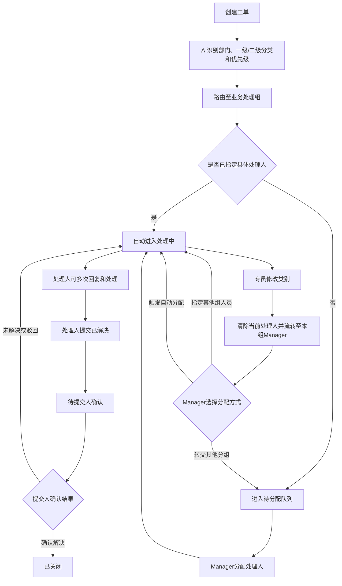

# 振兴 Helpdesk 需求清单（开发版）

> 文档状态：会议需求整理稿  
> 整理日期：2026-08-13  
> 适用对象：产品、开发、测试、实施团队

## 一、统一业务口径

系统需要同时保留三套独立数据，不得混用：

- **组织架构**：公司 → BG → BU → 部门/子部门。组织架构数据由Julian提供。
- **业务处理组**：负责接收和处理工单，人员可以加入多个业务处理组。
- **问题分类**：一级分类（Category）→ 二级分类（SubCategory）。

按本次会议结论统一为：

- Category 保留为“问题分类”。
- Department 表示提交人所属部门或工单路由部门。
- SLA规则和自动分配规则绑定一级分类。
- 看板支持按问题分类统计。

## 二、目标工单流程

核心原则：

- 回复、转派不得自动改变工单状态。
- 状态变更通过独立的状态操作完成。
- 工单指定具体处理人后，无需处理人手动接收或领取，直接进入“处理中”。
- 工单最终关闭必须由提交人确认。

## 三、功能需求清单

| 编号 | 模块 | 需求说明 | 验收要点 |
|---|---|---|---|
| HD-01 | 分配与接收 | 取消专员手动“接收/领取”环节 | 一旦指定具体处理人，工单自动变为“处理中”，记录分配人、分配时间和分配来源 |
| HD-02 | 回复记录 | 回复与关单完全拆分，回复页签不显示关闭按钮 | 提交人和处理人可以多次回复；按时间线展示发送人、发送时间、内容和附件 |
| HD-03 | 状态管理 | 增加独立的状态操作区 | 回复不改变状态；处理人只能提交“已解决/待确认”，不能直接关闭工单 |
| HD-04 | 关单确认 | 最终关闭必须由工单提交人确认 | 提交人可选择“确认解决”或“未解决/驳回”；驳回必须填写原因，工单返回“处理中” |
| HD-05 | 工单转交 | 支持将处理中工单转交给其他处理人 | 转交后更新处理人，状态保持“处理中”，原处理人和新处理人收到邮件通知 |
| HD-06 | 跨组转派 | 普通专员无跨组直接转派权限 | 专员修改工单类别后，工单流转至专员本组Manager；Manager可将工单转交给其他组的指定人员、转交给其他分组，或触发自动分配 |
| HD-07 | 部门内转派 | 专员可在本人有权限的同部门或处理组内转交 | 目标人必须具有对应业务处理组权限；记录转派原因、原处理人和新处理人 |
| HD-08 | 自动分配 | 自动分配规则绑定一级分类 | 支持新工单自动分配，也支持Manager对待分配工单手动触发自动分配；按最少未完成工单数或轮询选择人员，分配到具体人员后直接进入“处理中” |
| HD-09 | AI路由 | AI根据问题描述识别部门、问题分类和优先级 | 用户无需手动选择优先级；AI输出部门、一级分类、二级分类、优先级和置信度 |
| HD-10 | 专员修改类别 | 专员可以校正工单的一级/二级类别 | 保存新类别后，清除当前处理人，工单进入“待分配”并流转至专员本组Manager；由Manager决定转交其他组人员、转交其他分组或自动分配；记录修改前后类别和操作人 |
| HD-11 | 无规则兜底 | 未匹配到分类或分配规则时进入异常队列 | 工单进入对应Manager的“待分配”列表，不得静默丢失或随机分配 |
| HD-12 | 休假自动回复 | 支持维护处理人员休假时间和自动回复内容 | 休假人员不参与自动分配；收到新回复时自动邮件告知提交人，并通知Manager处理 |
| HD-13 | 多公司处理 | 同一处理人可以处理多个公司的工单 | 用户只归属一个行政组织，但可以加入多个跨公司业务处理组；数据权限按处理组和工单分配控制 |
| HD-14 | 用户同步 | 用户和基础角色从灵基平台导出后批量导入 | 支持新增、更新、停用和失败行反馈；以平台用户ID或邮箱幂等更新，避免重复用户 |
| HD-15 | 组织架构 | 预置BG、BU、部门三级组织层级 | 支持后续调整；需明确部门与子部门在组织层级中的映射关系 |
| HD-16 | 分类维护 | 新增独立的问题分类基础资料模块 | 支持一级/二级分类新增、编辑、排序和启停；被工单引用的分类不得直接物理删除 |
| HD-17 | SLA规则 | SLA规则绑定一级分类，不绑定二级分类 | 可按“一级分类＋AI优先级”配置首次响应时限和解决时限 |
| HD-18 | SLA工作日 | SLA仅计算有效工作时间 | 支持配置工作日、每日工作时间段、周末和公共节假日；自动计算首次响应及解决截止时间 |
| HD-19 | 节假日配置 | 后台新增公共节假日维护模块 | 支持日期、名称、适用范围和启停；节假日期间不累计SLA |
| HD-20 | 工单字段 | 工单列表和详情补充核心字段 | 左侧按页签展示进度、回复和评论，右侧展示基本信息：公司、部门、子部门、提交人、处理人、业务处理组、一级分类、二级分类、优先级、状态和处理时间 |
| HD-21 | 字段编辑 | 分类、子分类和处理人默认只读 | 仅有权限的专员、Manager或系统管理员进入编辑状态后显示下拉控件 |
| HD-22 | UI颜色 | 减少非必要颜色 | 仅状态、SLA预警等状态性信息使用颜色；普通卡片、分类和字段使用中性色 |
| HD-23 | 分类看板 | Dashboard增加问题分类分析 | 至少支持按照业务处理组、处理人、公司、一级分类和二级分类查看对应看板，并展示工单量、未关闭量、状态分布、SLA达成率、平均响应时间和平均解决时间 |
| HD-24 | 看板筛选 | 优先实现多维筛选能力 | 支持业务组、处理人、一级分类、二级分类、公司和时间范围筛选；筛选作用于全部指标 |
| HD-25 | 邮件通知 | 第一期只使用邮件通知 | 覆盖创建、分配、转派、回复、待确认、驳回、关闭、SLA预警和休假自动回复 |
| HD-27 | 审计日志 | 新增全链路、不可篡改的操作日志 | 记录创建、分配、AI识别、人工校正、回复、状态变化、转派、SLA变化及操作前后值 |
| HD-29 | 国际化 | 本次新增页面和字段同步支持中英文 | 角色、状态、分类、SLA、节假日、看板及邮件模板均需支持中英文 |
| HD-26 | 邮件跳转（二期） | 用户通过邮件内链接进入系统补充资料 | 二期实现，不纳入周一版本；不支持直接回复邮件生成回复，也不支持无账号用户通过邮件创建工单 |
| HD-28 | IT入职申请（二期） | 新增独立IT Requisition模块 | 二期实现，不纳入周一版本；与通用工单分开，承载电脑、License等固定申请流程，模板和审批流程另行确认 |

## 四、固定角色与权限

系统固定设置以下四类角色：

1. 普通工单提交者（Requester）
2. 工单处理专员（Agent）
3. 部门分组管理员（Manager）
4. 系统超级管理员（Admin）

| 功能 | 提交者 Requester | 处理专员 Agent | 部门经理 Manager | 超级管理员 Admin |
|---|---:|---:|---:|---:|
| 创建工单 | 是 | 是 | 否 | 是 |
| 查看工单 | 仅本人提交 | 仅分配给本人 | 所属部门/处理组 | 全部 |
| 多次回复 | 是 | 是 | 否 | 是 |
| 提交已解决 | 否 | 是 | 否 | 是 |
| 确认关闭/驳回 | 本人工单 | 否 | 否 | 管理例外 |
| 部门内转派 | 否 | 是 | 是 | 是 |
| 跨组直接转派 | 否 | 否，修改类别后提交本组Manager | 是 | 是 |
| 分配处理人 | 否 | 否 | 是 | 是 |
| 修改工单类别 | 否 | 是，修改后提交本组Manager | 是 | 是 |
| 触发自动分配 | 否 | 否 | 是 | 是 |
| 查看部门看板 | 否 | 个人范围 | 所属部门 | 全局 |
| 分类、SLA、节假日配置 | 否 | 否 | 否 | 是 |
| 组织和用户导入 | 否 | 否 | 否 | 是 |
| 实际处理工单 | 否 | 是 | **否** | 管理例外 |

Manager只负责所属范围内的任务分配和转派，不得回复工单、提交已解决、关闭工单或操作系统级配置。

## 五、工单状态定义

| 状态 | 说明 | 进入条件 | 可执行的主要操作 |
|---|---|---|---|
| 新建 | 工单刚创建，尚未完成路由 | 用户或AI创建工单 | AI识别、规则匹配 |
| 待分配 | 已识别处理组但尚未指定处理人，或专员修改了工单类别 | 仅路由到业务处理组、规则匹配失败，或专员保存新类别 | 本组Manager指定其他组人员、转交其他分组或触发自动分配 |
| 处理中 | 已指定具体处理人 | 自动分配、Manager分配、转派或提交人驳回 | 多次回复、转交、提交已解决 |
| 待提交人确认 | 处理人认为问题已解决 | 处理人执行“提交已解决” | 提交人确认解决或驳回 |
| 已关闭 | 提交人确认问题已解决 | 提交人执行“确认解决” | 查看、评价（如启用） |

状态变更必须写入审计日志，记录操作人、操作时间、变更前状态、变更后状态和操作原因。

## 六、SLA计算规则

### 6.1 规则绑定

- SLA规则绑定一级分类，不绑定二级分类。
- 优先级由AI根据问题描述自动判断，用户不手工选择。

### 6.2 计算口径

- SLA只累计配置的有效工作时间。
- 自动排除周末、公共节假日和非工作时间段。
- 首次响应时间从工单创建时间开始计算，以处理人第一次对外回复为完成点。
- 解决时间从工单创建时间开始计算，以工单进入“待提交人确认”为完成点。
- SLA截止时间需要在创建工单、修改一级分类或调整优先级后重新计算。
- SLA即将超时和已经超时均需要发送邮件通知。

### 6.3 公共节假日维护

后台新增公共节假日维护模块，至少包含：

- 日期
- 节假日名称
- 适用国家或地区
- 是否启用
- 备注

已发生的历史SLA结果不得因后续修改节假日配置而自动变化，除非管理员明确执行重新计算。

## 七、休假自动回复规则

- 管理员或处理人可以维护休假开始时间、结束时间和自动回复内容。
- 处于休假状态的人员不参与新的自动分配。
- 处理人进入休假状态时，系统应提醒Manager检查其未完成工单。
- 已分配的存量工单默认不自动转派，由Manager决定是否重新分配。
- 用户在处理人休假期间追加回复时，系统向用户发送自动回复邮件，并通知对应Manager。
- 休假结束后，人员自动恢复参与分配，无需手工启用。

## 八、分类、部门和业务处理组

### 8.1 问题分类

- 使用一级分类和二级分类两层结构。
- 一级分类用于SLA、自动分配规则和统计分析。
- 二级分类用于细化问题类型和统计，不直接绑定SLA与自动分配规则。
- 分类支持新增、编辑、排序、启用和停用。
- 已被工单引用的分类只能停用，不能物理删除。

### 8.2 组织部门

- Department表示用户所属的组织部门，不等同于问题分类。
- 用户只归属一个行政组织。
- 组织架构初始按BG、BU、部门三级导入，并预留后续层级调整能力。

### 8.3 业务处理组

- 业务处理组用于工单路由、分配和处理权限控制。
- 一个处理人可以加入多个业务处理组。
- 同一处理人可以处理多个公司的工单。
- 处理权限以业务处理组授权为准，不以用户行政组织作为唯一限制。

## 九、自动分配规则

自动分配流程：

1. AI识别工单所属部门、一级分类、二级分类和优先级。
2. 系统根据一级分类匹配自动分配规则。
3. 规则将工单路由至对应业务处理组。
4. 若规则配置为自动分配到个人，则按负载均衡或轮询策略选择处理人。
5. 指定处理人后，工单自动进入“处理中”。
6. 若只匹配到业务处理组，则工单进入“待分配”，等待Manager分配。
7. 若没有匹配规则，则进入异常待分配队列，并通知对应Manager。

负载均衡默认按处理人当前未关闭工单数量计算，休假或停用人员不参与计算。

### 9.1 专员修改类别后的流转

1. 专员修改工单的一级类别或二级类别并保存。
2. 系统保留原处理记录，清除当前处理人，将工单状态更新为“待分配”。
3. 工单流转至该专员所属业务处理组的Manager待办，不允许专员直接指定其他组或其他组人员。
4. Manager可以选择以下任一方式继续分配：
   - 转交给其他业务处理组的指定处理人；
   - 转交给其他业务处理组的待分配队列；
   - 根据新类别对应的分配规则触发自动分配。
5. 分配到具体处理人后，工单自动进入“处理中”；仅转交到分组时保持“待分配”。
6. 类别修改、处理人清除、Manager接收、转组和重新分配全过程必须写入审计日志。

## 十、工单页面调整

### 10.1 列表字段

工单列表至少展示：

- 工单号
- 工单标题
- 公司
- 部门
- 子部门
- 提交人
- 业务处理组
- 处理人
- 一级分类
- 二级分类
- AI优先级
- 工单状态
- 创建时间
- 处理时间
- SLA截止时间或剩余时间

### 10.2 详情字段

工单详情固定展示：

- 提交人姓名、邮箱、公司、部门和子部门
- 一级分类和二级分类
- 业务处理组和处理人
- AI优先级及识别结果
- 创建时间、分配时间、解决时间和关闭时间
- 工单描述、附件和AI对话上下文
- 完整回复时间线
- 完整操作审计记录

### 10.3 页面交互

- 普通查看状态下，核心字段固定展示，不使用无必要的下拉控件。
- 授权用户点击“编辑”后，才显示分类、子分类、业务处理组和处理人下拉控件。
- 回复区域只处理沟通内容，不显示关闭按钮。
- 状态变更、转派和分配应设置为独立操作。
- UI减少装饰性颜色，仅对工单状态、SLA风险和异常信息使用颜色。

## 十一、Dashboard调整

### 11.1 筛选条件

Dashboard至少支持：

- 公司
- 业务处理组
- 处理人
- 一级分类
- 二级分类
- 工单状态
- 时间范围

筛选条件应统一作用于页面全部指标和图表。

### 11.2 指标

第一期至少提供：

- 工单总量
- 新建工单量
- 未关闭工单量
- 已关闭工单量
- 状态分布
- 一级分类和二级分类分布
- 各分类平均首次响应时间
- 各分类平均解决时间
- SLA达成率
- 各处理人当前负载

优先保障筛选和数据准确性，复杂图表样式可以后续迭代。

## 十二、邮件通知

第一期只使用邮件作为用户通知渠道，暂不集成即时通讯。

邮件通知至少覆盖：

- 工单创建成功
- 工单分配
- 工单转派
- 新增回复
- 工单进入待确认
- 提交人驳回
- 工单关闭
- SLA即将超时
- SLA已经超时
- 处理人休假自动回复

第一期邮件仅承担通知作用。邮件内链接跳转系统补充资料、继续回复的能力放在二期实现，不纳入周一版本。

第一期明确不支持：

- 直接回复邮件写入工单回复记录。
- 无系统账号的用户通过邮件创建工单。
- 将邮件内容自动转换为新工单。

## 十三、全链路审计日志

审计日志至少记录：

- 工单创建
- AI识别结果
- 人工校正AI结果
- 自动或人工分配
- 回复
- 状态变更
- 部门内转派
- 跨部门转派申请与执行
- SLA规则和截止时间变化
- 处理人变更
- 分类变更
- 工单关闭或驳回

每条日志至少包含：工单ID、操作类型、操作人、操作时间、变更前值、变更后值、操作原因和来源。

审计日志不得由普通业务用户修改或删除。

## 十四、现有逻辑需要废弃或调整

开发需要同步修改代码、数据库、接口和旧需求文档中的以下逻辑：

- 废弃“已分配后由专员领取”的流程。
- 废弃专员可查看所属公司全部工单的规则，改为只看分配给本人或明确授权范围内的工单。
- 废弃普通专员直接跨部门转派权限。
- 废弃回复时同时关闭工单的操作。
- 废弃用户手动选择优先级，改为AI判断。
- 原本不在范围内的分类看板调整为本次需求。
- Category与Department不得合并为同一个数据字段。

## 十五、开发前待确认事项

以下事项会影响数据结构或流程，开发前需要产品或客户确认；未确认前建议按默认口径实现：

| 编号 | 待确认事项 | 建议默认口径 |
|---|---|---|
| Q-01 | 休假人员已有未完成工单如何处理 | 不自动转派，由Manager人工检查和调整 |
| Q-02 | 自动分配是分配到个人还是只分配到处理组 | 两种模式均支持；分配到个人后直接进入“处理中” |
| Q-03 | SLA首次响应完成点 | 处理人第一次对外回复 |
| Q-04 | SLA解决完成点 | 工单进入“待提交人确认” |
| Q-05 | 等待用户补充资料期间是否暂停SLA | 第一期暂不暂停 |
| Q-06 | 待确认超时后是否自动关单 | 第一期不自动关单，必须由提交人明确确认 |
| Q-07 | 部门、子部门与BG、BU的层级映射 | 由Julian提供最终组织架构资料 |
| Q-08 | “处理时间”的统计定义 | 有效工作时间内，从进入“处理中”到进入“待提交人确认”的累计时长 |
| Q-09 | Manager跨部门转派范围 | 默认只允许转派到预先配置的协作部门 |
| Q-10 | IT Requisition审批节点和表单字段 | 二期作为独立需求另行确认，不与通用工单硬编码在一起 |

### 15.1 外部输入资料

以下资料由Julian提供，作为组织建模和产品界面调整的输入：

| 编号 | 责任人 | 需提供资料 | 用途 | 要求 |
|---|---|---|---|---|
| INPUT-01 | Julian | 组织架构资料 | 确认公司、BG、BU、部门、子部门及人员归属关系 | 优先提供结构化Excel；至少包含组织编码、组织名称、上级组织、组织层级和负责人 |
| INPUT-02 | Julian | 现有产品访问链接，或无法访问时提供完整页面截图 | 核对现有产品的页面布局、字段、交互和UI风格 | 链接需可访问；如提供截图，应覆盖列表页、详情页、回复页、分配/转派页、配置页和Dashboard |

资料未提供前，开发可以按本文档完成通用功能，但组织初始化、页面还原和最终UI验收不能视为完成。

## 十六、范围和优先级建议

### P0：周一后台版本

- 固定四类角色和权限边界。
- 指定处理人后自动进入“处理中”。
- 取消专员手动接收/领取。
- 回复与状态操作拆分，支持多次回复。
- 提交已解决、提交人确认关闭和驳回流程。
- 工单转交及跨部门权限控制。
- 工单核心字段补充。
- 一级/二级分类维护。
- Manager任务分配页面。
- 基础审计日志。
- UI颜色简化。

### P1：端到端流程联调

- AI识别部门、分类和优先级。
- 自动路由和自动分配。
- 多公司业务处理组授权。
- SLA工作日、节假日及截止时间计算。
- 休假自动回复。
- 邮件通知。
- 用户批量导入。
- 分类看板和多维筛选。

### P2：二期需求

- 邮件内链接跳转系统补充资料和继续回复。
- IT Requisition独立申请模块。

### 独立交付项

- 部署方案和资源容量评估。
- 灵基平台用户同步正式接口。

## 十七、部署与配套交付

### 17.1 部署方案

需要输出以下两种部署路径的中英文对比文档：

1. ERP集群独立容器节点。
2. 灵基新加坡公有云节点。

当前推荐方案：在ERP集群单独开辟容器节点，复用现有子域名，无需额外采购域名和RDS资源。最终需要IT团队确认网络、权限和资源条件。

### 17.2 容量估算

按以下规模评估系统资源：

- 日工单量：500单。
- 系统用户：1000人。
- 工单处理人员：50人。

容量评估应覆盖应用节点、数据库、附件存储、邮件发送、备份、日志和并发访问。

### 17.3 配套资料

需要同步交付：

- 中英文部署方案对比文档。
- 一级/二级分类规则模板。
- 工单状态及转派流程图。
- 角色权限矩阵。
- 资源容量估算。

## 十八、完成标准

本需求不能仅以页面展示或接口调用成功作为完成标准。开发和测试至少需要验证：

- 四类角色实际登录后的菜单、数据和操作权限符合权限矩阵。
- 指定处理人后状态自动进入“处理中”，且无需再次接收。
- 多次回复不会自动关闭工单或改变状态。
- 只有提交人可以完成最终确认关闭或驳回。
- 普通专员不能跨组直接转派。
- 专员修改类别后，工单进入本组Manager待办，且原处理人被清除。
- Manager可以转交至其他组的指定人员、其他分组队列或触发自动分配。
- Manager不能回复或实际处理工单。
- 同一处理人可以获得多个公司业务处理组的工单权限。
- SLA计算正确排除周末、非工作时间和公共节假日。
- 休假人员不参与自动分配，休假自动回复能够实际发送。
- 看板筛选后的指标与工单明细数据一致。
- 所有关键操作均可在审计日志中回查。
